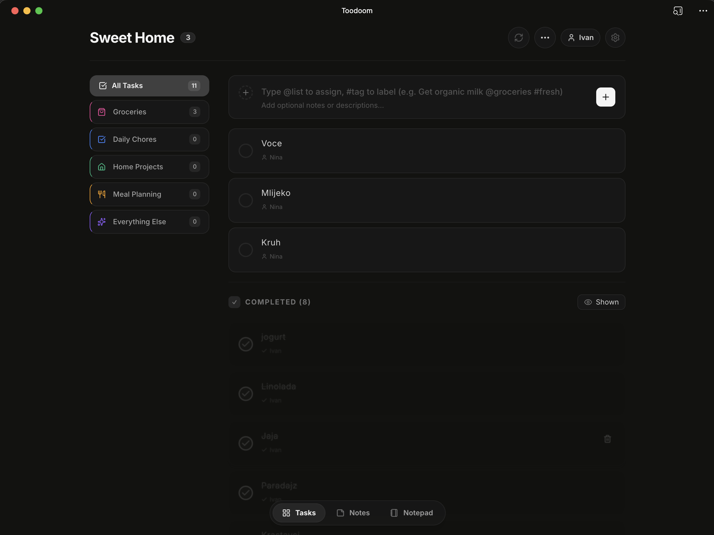
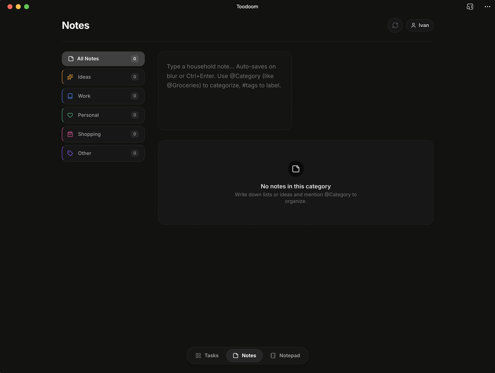
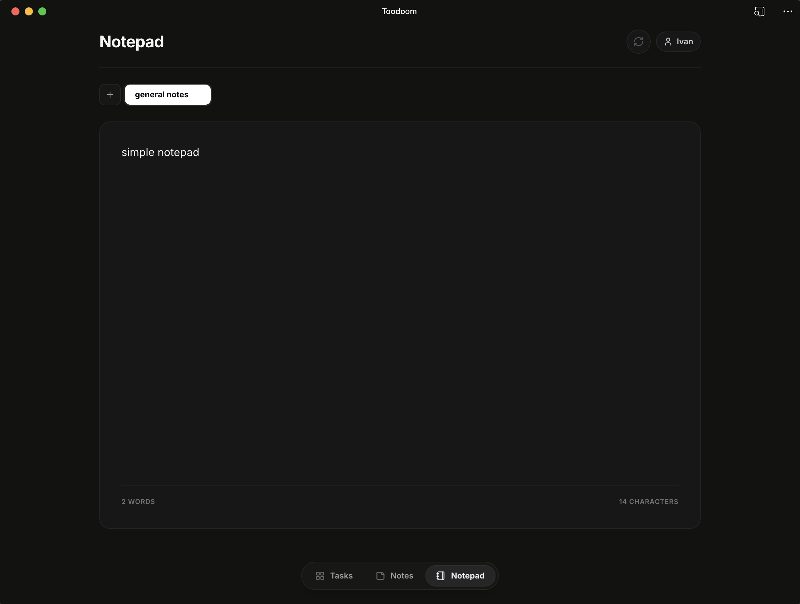
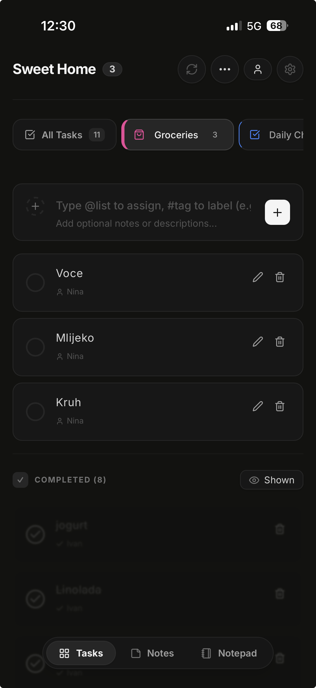
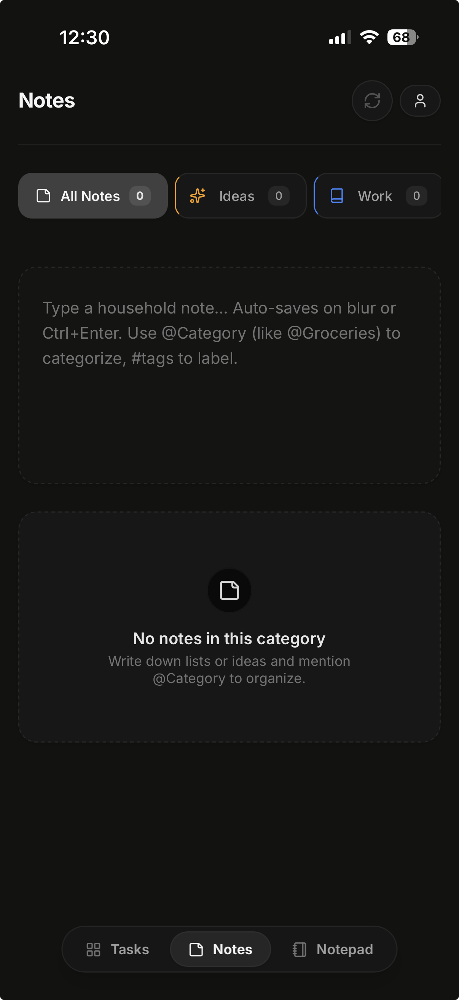
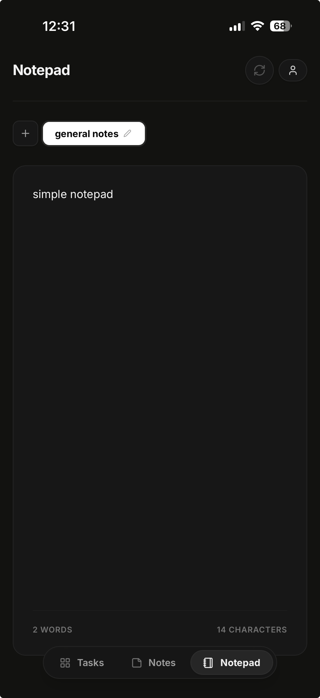

# Toodoom

Toodoom began as a weekend idea after noticing that every simple tasks app had turned into a dashboard for teams. We just wanted a gentle place where my wife and I could share an `@shopping` list, keep track of `@household` fixes, and scribble personal notes. The result is a shareable household desk that feels calm and focused. My wife and I use it every day now. Switch between notes and tasks, drop in `#tags`, assign `@categories`, and keep life admin tidy without corporate bloat.

## Highlights

- ✨ **Dual brain** – maintain boards of tasks _and_ sticky notes in the same app.
- 🏷️ **Smart metadata** – apply `#tags` for instant filtering and `@categories` for lightweight project buckets.
- 🤝 **Shareable lists** – invite household members with PIN-protected profiles and stay in sync together.
- 🌙 **Light & dark** – polished themes that automatically remember your preference.
- 📱 **PWA-ready** – install Toodoom on desktop or mobile and run it like a native app.
- 🔒 **Per-profile access** – owner controls who can join; every member authenticates with a PIN.
- 🐳 **Self-host friendly** – Docker Compose setup included so you can launch the full stack in one command.
- 🗄️ **SQLite** – lightweight, zero-config persistence with WAL mode for safe concurrent writes.

## Screenshots

### Desktop

| Tasks | Notes | Notepad |
| ----- | ----- | ------- |
|  |  |  |

### Mobile

| Tasks | Notes | Notepad |
| ----- | ----- | ------- |
|  |  |  |

## Table of contents

- [Highlights](#highlights)
- [Screenshots](#screenshots)
- [Architecture](#architecture)
- [Quick start](#quick-start)
  - [Prerequisites](#prerequisites)
  - [Install](#install)
  - [Run the app](#run-the-app)
- [Configuration](#configuration)
- [Progressive Web App](#progressive-web-app)
- [Self hosting](#self-hosting)
  - [Docker Compose](#docker-compose)
- [Available scripts](#available-scripts)
- [Contributing](#contributing)
- [License](#license)

## Architecture

Toodoom is a React 19 application backed by an Express + SQLite server.

```
┌────────────────────┐      ┌──────────────────────────┐
│   React frontend   │◄────►│  Express API + SQLite    │
│  • Tasks & notes   │ http │  • Households & members  │
│  • PWA shell       │      │  • PIN auth              │
│  • Optimistic UI   │      │  • OpenAI sorting        │
└────────────────────┘      └──────────────────────────┘
```

- Each household has a unique slug URL (e.g. `smith-family-4821`).
- Members are added by the owner and authenticate with a PIN on each device.
- Notes and notepads are per-profile — private to each member.
- Tasks and categories are shared across the whole household.

## Quick start

### Prerequisites

- Node.js 20+

### Install

```bash
npm install
```

### Run the app

```bash
npm run dev
```

Visit `http://localhost:3000`.

Optional — OpenAI list sorting:

```bash
cp .env.example .env.local
# set OPENAI_API_KEY=your_key
```

## Configuration

| Variable | Default | Purpose |
| -------- | ------- | ------- |
| `PORT` | `3000` | HTTP port |
| `DB_PATH` | `./households.db` | SQLite database path |
| `OPENAI_API_KEY` | — | Enables AI list sorting |

## Progressive Web App

Toodoom ships as a full PWA via `vite-plugin-pwa`. Install it like any modern PWA:

- Open the app in Safari (iPhone) → Share → **Add to Home Screen**.
- Open in Chrome (Android/desktop) → "Install app".

Drop your icons into `public/icons/` — see `index.html` for the full list of required sizes.

## Self hosting

### Docker Compose

```bash
# Pull image and start
docker compose up -d

# With OpenAI key
OPENAI_API_KEY=your_key docker compose up -d
```

Image: `ghcr.io/ivucicev/toodoomv2:latest`

SQLite database persists in Docker named volume `toodoom_data`. Stop and restart freely without losing data.

## Available scripts

| Command | Description |
| ------- | ----------- |
| `npm run dev` | Dev server with HMR. |
| `npm run build` | Build frontend + server bundle into `dist/`. |
| `npm start` | Run the production build. |
| `npm run lint` | TypeScript type check. |

## Contributing

Issues, fixes, and improvements are warmly welcomed. Please:

1. Fork the repository.
2. Create a feature branch: `git checkout -b feat/amazing-idea`.
3. Commit with context.
4. Open a pull request describing the change.

## License

This project is released under the MIT License. See `LICENSE` for details.
